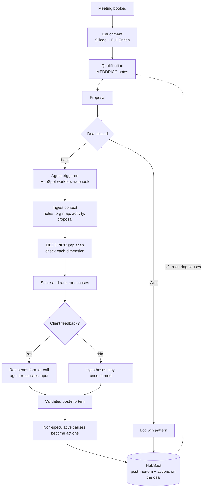

# StopMortem
GTM Hackathon
# StopMortem

> An agent that turns every lost deal into a scored post-mortem and reusable corrective actions — so the sales team stops losing the same way twice.

**Status:** design / specification. This README is the source of truth for the workflow; the agent is not yet built.

---

## Why this exists

We are a cloud-native SaaS ISV selling an ERP for pharmacists. Our deals are technical, multi-stakeholder, and slow — and when we lose one, the reason usually dies with the rep.

Most lost deals are never dug into. The `Closed Lost` reason gets set to whatever's quickest, the qualification notes go stale, and the next quarter we lose an almost identical deal for an almost identical reason. We're paying the tuition every time and never keeping the lesson.

`StopMortem` fixes the learning loop, not the losing. Every lost deal is analysed against what a well-qualified, winnable deal should have looked like; the agent produces ranked, evidence-backed root causes; and each non-speculative cause becomes a corrective action the team can reuse. Over time, the action that keeps recurring is the mistake worth fixing first.

---

## Personas

| Persona | Role in the system |
| --- | --- |
| **Lola — Sales** | Primary user. Runs the deal, owns the qualification, validates the post-mortem, decides ambiguous merges. The agent drafts; Lola approves anything client-facing. |
| **Client — DSI, CTO, CIO, CEO, Founders** | The buying committee on the other side. The agent reasons about *which* of these was (or wasn't) engaged — a missing economic buyer is one of the most common root causes it looks for. |

---

## What it does

1. Rides alongside the normal HubSpot pipeline and stays silent while a deal is live.
2. Wakes up the moment a deal is marked lost — triggered by a native HubSpot workflow, no external orchestration engine.
3. Reconstructs the deal from its own evidence — qualification notes, activity, proposal, org map — rather than trusting the `Closed Lost` dropdown.
4. Runs a MEDDPICC gap scan, scores the resulting root causes, and explains the top one with the actual evidence.
5. Optionally collects client feedback (via the rep) to upgrade hypotheses to confirmed facts.
6. Converts every non-speculative cause into a corrective action and writes the post-mortem and its actions back onto the HubSpot deal.

---

## How it works



The dashed line is the direction of travel: once losses accumulate, what the analysis learns is surfaced back at the qualification stage of the next deal. In v1 that link is manual; v2 automates it (see roadmap).

---

## The root-cause engine

The scan walks each MEDDPICC dimension and asks two questions: *was it captured?* and *does the rest of the evidence agree with it?* The answer determines which confidence tier the cause lands in.

| Tier | Colour | What it means | Example |
| --- | --- | --- | --- |
| **Documented gap** | green | A required dimension is missing from the notes. This is a fact, not a guess — thin qualification becomes the finding. | Budget was never captured. |
| **Evidence conflict** | amber | The dimension was captured, but the proposal or activity contradicts it. | Proposal priced above the budget recorded in discovery. |
| **Inferred hypothesis** | grey | Nothing in the evidence speaks to it; the agent inferred it. Flagged, never actioned until confirmed. | Competitor may have had an incumbent advantage. |

The HubSpot `Closed Lost` reason is treated as a **claim to verify**, not ground truth. If the evidence disagrees with the rep's stated reason, the agent says so.

Client feedback, when the rep obtains it, **upgrades any tier to confirmed**.

---

## Scoring

"Best root cause" is decided by a rubric, not by whichever cause sounds most dramatic. Three factors combine into a score:

- **Evidence strength** — the tier above (documented > conflict > inferred).
- **Causal weight** — how directly this plausibly lost *this* deal at *this* stage. A missing economic buyer usually outranks a small price gap.
- **Corroboration** — how many independent signals point to it; confirmed client feedback is the strongest.

These can pull against each other on purpose. A documented gap can be out-ranked by an evidence conflict if the conflict was more directly responsible for the loss — evidence strength alone is not the ranking.

Each cause ships with a one-line explanation that **cites the evidence** rather than asserting a conclusion.

---

## Actions and the playbook

Every non-speculative cause (green and amber only) becomes a reusable, MEDDPICC-tagged corrective action. Grey hypotheses stay diagnosed but un-actioned until confirmed.

**v1** writes the post-mortem and its actions directly onto the HubSpot deal record. No separate app, no counting yet — the deliverable is a rigorous autopsy per lost deal.

**v2** introduces the counted, deduplicated playbook. On write, the agent will not append blindly. It compares each new action against existing entries **by meaning, not exact wording** (a job for Claude, not string matching). Then:

- **Near-identical** → increment that entry's counter and attach the deal as evidence. No new row.
- **Clearly different** → create a new entry.
- **In between** → surface to the rep: *"this looks like an existing action — merge or keep separate?"*

The middle band keeps a human on the ambiguous merges without slowing down the obvious ones, and guards against over-merging two causes that sound alike but aren't (e.g. *budget never captured* vs *budget captured but overpriced* — different problems, different actions).

Because entries are counted rather than duplicated, the playbook self-sorts: the entry at "triggered 30 times" is the top recurring mistake. That is the whole cross-deal trend analysis, delivered for free by the dedup counter.

---

## Guardrails

- **Human in the loop on anything client-facing.** The agent drafts the feedback form and the call guide; the rep approves and sends. The agent never contacts a client on its own.
- **The rep validates the post-mortem** before it's written back.
- **Speculative causes are never coached on.** Grey tier is clearly labelled and excluded from actions.
- **The dropdown is not trusted.** Loss reasons are derived from evidence.

---

## Architecture and stack

No external orchestration engine. A native HubSpot workflow fires on `Closed Lost` and calls a Claude agent (Anthropic API with tool use); the agent orchestrates every other call itself.

| Tool | Role |
| --- | --- |
| **HubSpot** (CRM) | Owns the pipeline stages, fires the lost-deal trigger via a native workflow, and holds the writeback — the post-mortem and actions live on the deal record. |
| **Claude** | Both the reasoning layer and the runtime. Runs the MEDDPICC gap scan, scoring, and evidence-cited explanations, and orchestrates the tool calls. Hosted as a small serverless endpoint the HubSpot workflow can hit. |
| **Sillage** | Org-chart mapping. Lets the agent check whether the economic buyer (DSI / CTO / CIO / CEO / Founder) was actually engaged. |
| **Full Enrich** | Contact enrichment feeding the org map. |

---

## Roadmap

- **v1** — per-deal scored post-mortem with evidence-derived causes and corrective actions, written back to HubSpot. Only the four core tools; no extra SaaS.
- **v2** — the counted, semantically-deduplicated playbook and the recurring-cause view. This is the phase that needs a place to accumulate entries (a HubSpot custom object, or Notion) and closes the qualification feedback loop automatically.
- **Later** — live qualification scoring at the Qualification stage, so gaps are flagged *before* the deal is lost rather than diagnosed after.

---

## Repository layout

_TODO — fill in once the agent and prompt assets are committed._

```
/
├── README.md            this file
├── agent/               the Claude agent (Anthropic API + tool use)
├── prompts/             gap scan, scoring, feedback-draft prompts
└── hubspot/             workflow config + writeback schema
```

---

